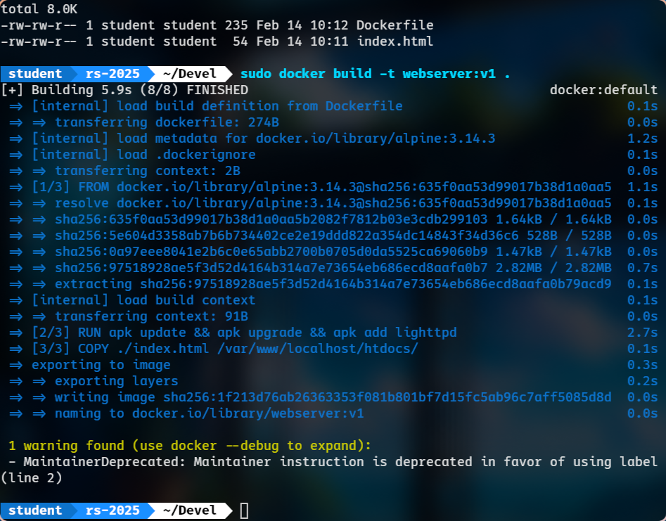
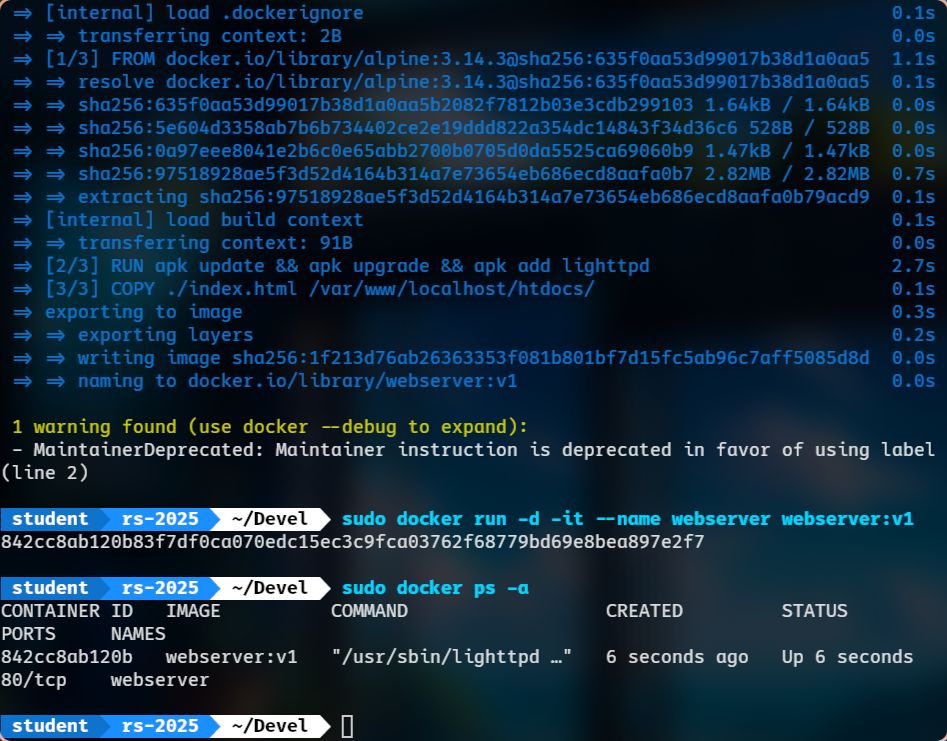
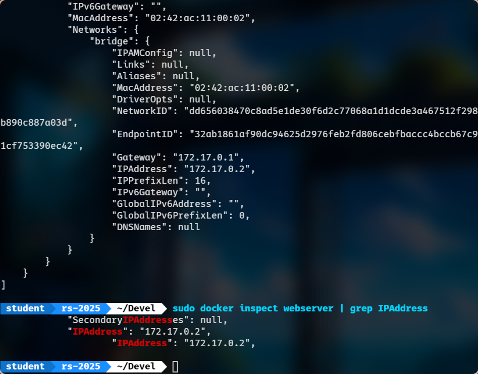
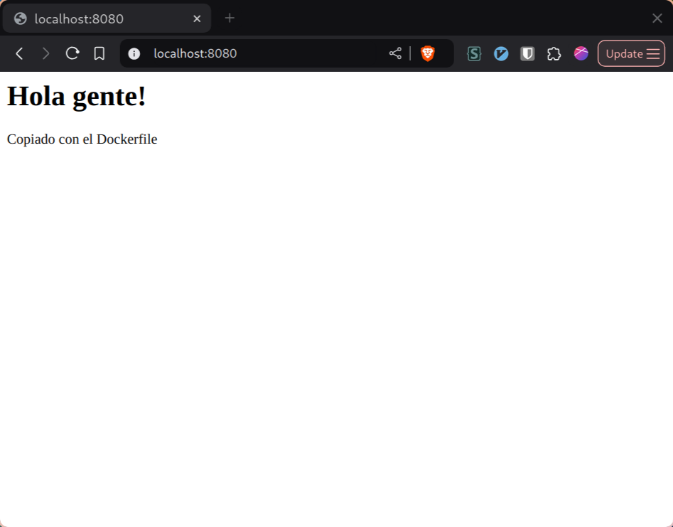
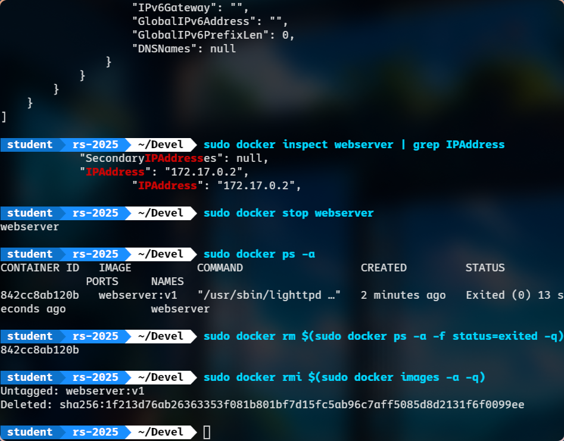

# Redes Software - Lab 1: Tecnologías de Virtualización
**`[GITT]` `[Sem 3.2]` `[SNs]` `(Spring 2024)`**

**Ingeniería en Tecnologías de Telecomunicación** | *Universidad Carlos III de Madrid*

Grupo X

* Alonso Herreros Copete
* Bryan Elías Todita Todita

---

<!-- Template: https://docs.google.com/document/d/1MpYur83ND4kV8_3bVIE4ileRg50EMCoppSJvoei2EuQ/edit?tab=t.0 -->

## Hito 1

## Hito 2

## Hito 3

## Hito 4

### Paso 1

### Pasos 2 y 3

### Paso 4

En este punto, para acceder al servidor desde el navegador en mi máquina local,
creo una nueva conexión SSH con un túnel: del puerto `8080` del cliente SSH
(sistema anfitrión) al contenedor en el servidor SSH (que está escuchando en el
puerto `80` en el contenedor en el sistema huésped)

### Paso 5

